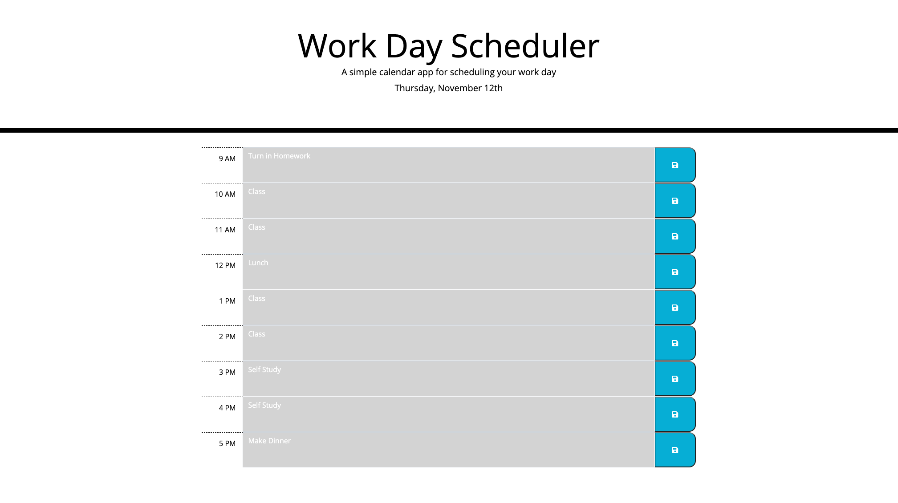

# work_day_scheduler

This is a simple work day scheduler that allows one to input daily tasks into an hourly planner.

Tasks can be saved to local storage so they remain persistant, even if the browser window is closed.  To save them, after entering the task in the hour slot, click the button on the right side of the bar.

The colors of the bars change to denote past, present and future tasks.

Further development will enable longer term planning, but so far, it is only one day at a time.

